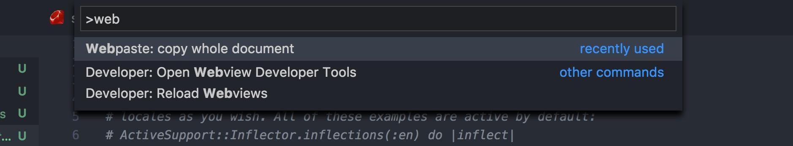

# webpaste README

## Usage

Exec command webpaste

## Features

Describe specific features of your extension including screenshots of your extension in action. Image paths are relative to this README file.

> Tip: Many popular extensions utilize animations. This is an excellent way to show off your extension! We recommend short, focused animations that are easy to follow.

## Requirements

* request-promise
* node-copy-paste

## Extension Settings

## Release Notes

Users appreciate release notes as you update your extension.

### 0.0.1

vscode webpaste

support provider:
* ptpb.pw

-----------------------------------------------------------------------------------------------------------

### For more information

* [Visual Studio Code's Markdown Support](http://code.visualstudio.com/docs/languages/markdown)

**Enjoy!**
